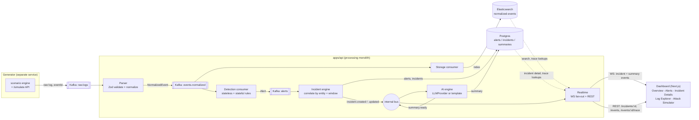

# Argus

> The hundred-eyed watchman — an AI-powered, event-driven security event analysis platform.

A scenario-driven log generator feeds **Kafka**. A processing monolith normalizes every event
against a shared **Zod** contract, runs a stateless + stateful **detection engine**, correlates
alerts into **incidents** (Postgres/Prisma), and asks an **LLM** for a plain-language incident
summary (with a deterministic template fallback — the whole stack runs with zero API keys). Every
alert, incident, and summary streams live over **WebSockets** to a real-time dark security-console
**dashboard** (Next.js), which also ships an interactive **Attack Simulator**, a **Log Explorer**,
and a **pipeline trace view** that follows one event from raw log to AI summary.


## Architecture



## Stack

Node 24 · TypeScript (strict) · Fastify · Kafka (KRaft) · Elasticsearch · PostgreSQL (Prisma) ·
Next.js 16 · WebSockets · shadcn/ui · TanStack Query · Recharts · Framer Motion · Docker Compose ·
pnpm + Turborepo.

## Repository layout

```
apps/
  generator/    # scenario-driven log emitter -> Kafka, + the /simulate attack-trigger API
  api/          # processing monolith: streaming, parser, storage, detection, incident, ai, realtime
  dashboard/    # Next.js real-time dashboard (Overview, Alerts, Incident Details, Log Explorer, Attack Simulator)
packages/
  contracts/    # Zod schemas + inferred types — the single source of truth for every event
  config/       # env parsing + validation (fail-fast at boot)
  logger/       # pino structured logging + correlation-id helpers
```

## Prerequisites

- Node.js >= 20 (24 recommended — see `.nvmrc`)
- pnpm 10 (`corepack enable` picks up the pinned version)
- Docker + Docker Compose

## Getting started

```bash
# 1. Install dependencies
pnpm install

# 2. Configure environment
cp .env.example .env
# On Windows/machines where 5432 or 4000 are already taken, see the comments in .env.example.

# 3. Boot infrastructure (Kafka, Elasticsearch, Postgres)
pnpm infra:up
pnpm infra:logs      # follow logs; wait for healthchecks to pass

# 4. Run the Postgres migration (alerts / incidents / summaries)
pnpm --filter @argus/api db:migrate

# 5. Run everything in dev mode (generator, api, dashboard)
pnpm dev
```

Then open the dashboard at **http://localhost:3000** — the landing page links straight into the live
console. The generator emits low-rate benign background traffic immediately, so the feed is never
empty; use the **Attack Simulator** page (or `POST http://localhost:4200/simulate/:scenario`) to fire
one of five attack scenarios on demand and watch it become an alert, an incident, and an AI summary
in real time.


### Useful commands

```bash
pnpm typecheck           # tsc across the workspace
pnpm lint                # eslint
pnpm format              # prettier --write
pnpm test                # vitest — parsers, detection rules, window store, scenarios, ai queue
pnpm test:smoke          # real Kafka -> parse -> store integration check (needs infra + api running)
pnpm infra:down          # stop infra   |   pnpm infra:reset wipes volumes
```

### Running with a real LLM

The AI layer runs with **zero API keys** by default (deterministic template summaries). To get real
LLM-generated summaries, set in `.env`:

```bash
LLM_PROVIDER=groq            # or "gemini"
GROQ_API_KEY=...             # or GEMINI_API_KEY
